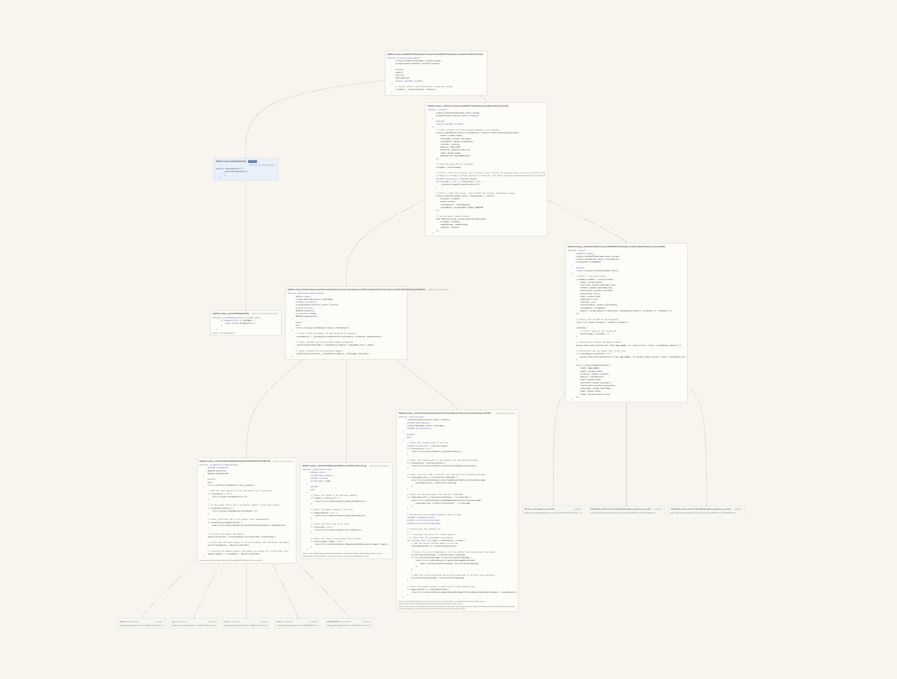

# SolFlow

A navigation tool for Web3 security auditors. Takes a Solidity repository, produces one interactive Flow per entry point — a syntax-highlighted, navigable graph rooted at that function with its complete internal call tree.

*Long-form name: Solidity Flow Navigator. CLI command: `solflow`.*

<!-- TODO post-sprint: regenerate screenshot from a live v0.6.1
     run showing short-form titles, bidirectional layout, and
     modifier upper-left placement. Caption may need refresh.
     Candidate flows: Aave V3 Pool.borrow, Sablier
     createWithDurationsLT, or Morpho borrow — pick whichever
     shows at least one modifier and several expanded children
     in a single frame. -->


*Sablier V2 Core — `SablierLockup.createWithTimestamps`. Cream nodes are in-scope functions with syntax-highlighted source, the blue badge is an inline modifier, and gray dashed nodes are external library calls (ERC721, SafeERC20, PRB-math). Free-function targets render with a muted `[no contract]` suffix.*

## What it does

For each `external`/`public` function (plus `receive` and `fallback`) on each contract:

- Builds the complete internal call tree rooted at that entry point.
- Resolves inherited entry points to the function body that actually runs.
- Resolves **within-body virtual dispatch** through the invoker contract's C3 chain — so a call to `_update` from an inherited `transferFrom` shows the most-derived override that actually executes at runtime, not the base-class lexical target.
- Folds modifiers inline into the function's call tree.
- Surfaces calls into external dependencies (`lib/`, `node_modules/`, or any user-configured stub path) as terminal stubs.
- Marks unresolvable dispatch (interface calls without binding, low-level `.call()`, dynamic Yul, abstract functions with no implementation in the chain) as explicit **unresolved** nodes — never silently omits, never guesses.
- Renders the result as HTML+SVG with pan, zoom, syntax-highlighted source, and keyboard shortcuts. The default renderer is progressive — each Flow opens with just the entry point and its modifiers visible and grows on click — and lays out bidirectionally around the root, with modifiers stacked upper-left, body-call children auto-balanced left/right under a no-crossings constraint, short-form node titles (`Contract.method(...)`), and the full canonical signature available on hover.

## Why

Most of the cold-start cost at audit kickoff is navigation — figuring out what calls what, where inheritance lands, which interface implementations matter. Existing tools either over-aggregate (one mega-graph of the whole repo) or under-resolve (interface and inheritance boundaries become dead ends). SolFlow's bet is that **one Flow per entry point** matches how auditors actually reason about attack surface.

## What it doesn't do

- **Doesn't find vulnerabilities.** It's a navigation aid, not a scanner.
- **Doesn't replace reading code.** It makes reading faster.
- **Doesn't follow dynamic dispatch.** `addr.call(...)`, runtime `delegatecall`, and Yul opcodes with computed targets are marked **unresolved**, never guessed.
- **Doesn't auto-resolve interface calls.** Calls through interfaces are marked unresolved. Manual interface binding via config is spec'd (§13.2) but not yet implemented.
- **Doesn't compile your code.** Delegates to `crytic-compile`. If your repo doesn't build (`forge build`, etc.), neither does SolFlow.

## Install

Currently dev-install only (not yet on PyPI):

```bash
git clone https://github.com/norah1499/solidity-flow-navigator.git
cd solidity-flow-navigator
python -m venv .venv
.venv/bin/pip install -e .
```

Python 3.11+ required (uses `tomllib` from stdlib). `pipx` is the intended distribution once a release is cut.

## Quick start

```bash
.venv/bin/solflow path/to/your/foundry/repo
```

Starts a local Flask server on `http://127.0.0.1:8080` (always bound to `127.0.0.1` — never exposed externally). If port 8080 is taken, solflow probes upward for the first free port and prints the chosen URL. Open it in your browser. The index page lists every detected entry point, grouped by contract and split into mutating vs. read-only sections. Click an entry point to see its Flow.

For a specific port:

```bash
.venv/bin/solflow path/to/repo --port 8081
```

An explicit `--port N` that is already in use is a hard error — solflow will not silently reassign off a value you asked for.

For the bird's-eye view of a whole call tree at a glance — useful for orientation on a new codebase or for small flows where the full visual mass is informative rather than overwhelming — pass `--expand-all`:

```bash
.venv/bin/solflow path/to/repo --expand-all
```

`--expand-all` is the progressive renderer with its initial state set to "everything expanded" — per-line edge anchoring, modifier placement, and the left/right direction model all apply identically; only the initial expansion state differs. (This replaces the pre-v0.10 `--legacy` all-at-once renderer.)

**Keyboard shortcuts on a Flow page:** `0` or `r` resets zoom and pan to fit-to-frame.

## Scope configuration

Sensible defaults run on first invocation: excludes `**/test/**`, `**/tests/**`, `**/*.t.sol`, `**/mocks/**`, and any contract matching `*Mock*`. Test and mock contracts stay out of the entry-point index unless you ask for them.

Override defaults in `solflow.toml` at the working directory:

```toml
[scope]
exclude_paths     = ["**/*.t.sol", "**/test/**", "**/mocks/**"]
exclude_contracts = ["*Mock*", "Helper*"]
inline_libraries  = ["forge-std"]                  # recurse into matched libs under lib/
stub_paths        = ["src/libraries/SVG*.sol"]     # treat matched in-tree paths as terminal stubs
```

Or via CLI flags (each repeatable, append to the resolved value):

```bash
.venv/bin/solflow . \
  --exclude-path "**/scripts/**" \
  --exclude-contract "Test*" \
  --stub-path "src/libraries/MathLib.sol" \
  --inline-library "forge-std"
```

To clear the built-in path or contract excludes for full-codebase visibility (useful for auditing test setups themselves), set the matching key to an empty list in `solflow.toml`:

```toml
[scope]
exclude_paths     = []   # clears **/test/**, **/tests/**, **/*.t.sol, **/mocks/**
exclude_contracts = []   # clears *Mock*
```

`--config <path>` points at an alternate TOML config file when `solflow.toml` lives outside the working directory.

See §11.2 of [`solidity-flow-navigator.md`](solidity-flow-navigator.md) for the full configuration semantics and resolution order.

## Trust boundaries

SolFlow operates entirely locally. Your audit code is never uploaded. The Flask server binds to `127.0.0.1` only.

When a call cannot be resolved statically, the node is marked **unresolved** with a specific reason: `INTERFACE_CALL_NO_BINDING`, `LOW_LEVEL_CALL`, `YUL_DYNAMIC_DISPATCH`, or `ABSTRACT_NO_IMPLEMENTATION`. The auditor should treat these as the surfaces where manual inspection is required. The tool's job is to be honest about what it doesn't know, not to guess.

## Spec

The source of truth is [`solidity-flow-navigator.md`](solidity-flow-navigator.md). It defines architecture, data contracts, scope semantics, virtual dispatch resolution, and known limitations. If anything in this README contradicts the spec, the spec wins.

## Status

**v0.6.1.** Pre-1.0 — interfaces and defaults may change. v0 success criteria are met (see §15 of the spec); v0.x is calibration and correctness work driven by real-codebase testing. Codebases the tool has been run against so far: Solmate, Aave V3, Morpho Blue, Sablier V2 Core.

## License

Copyright © 2026 norah1499. All rights reserved.

This project is currently private. An open-source license will be granted when the tool is published for general distribution.
