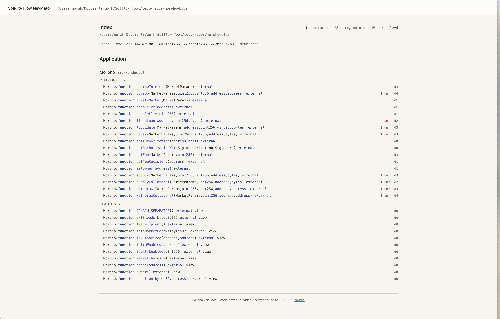
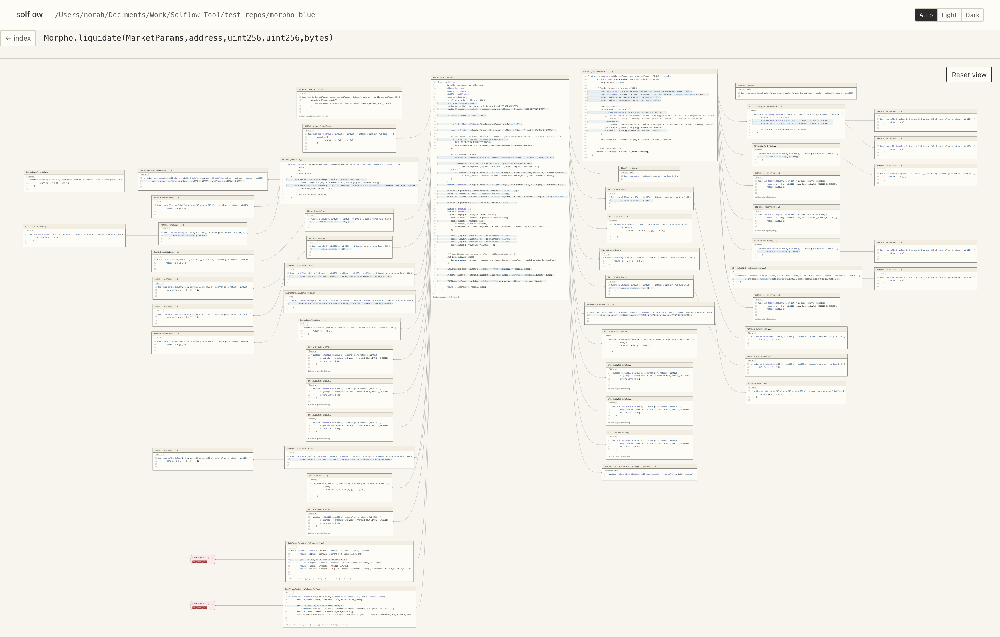
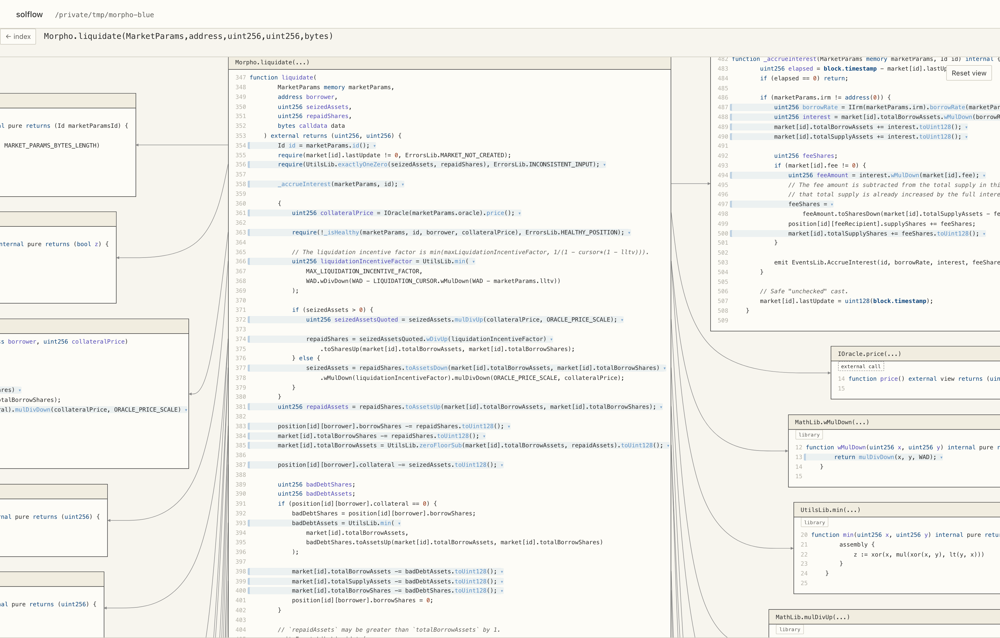

# SolFlow (Solidity Flow Navigator)

Compiles a Solidity repository, extracts call-graph facts with Slither, and serves an interactive call-flow visualization in your browser. Built for smart contract auditing.

## What it does, and does not

Shows how calls flow through a contract: entry points, callees, modifiers, and unresolved branches, laid out for fast navigation. Not a vulnerability scanner; makes no security claims. Unresolved branches are always marked as unresolved rather than guessed, so the picture never silently lies (P4).

## Screenshots

The index lists every external entry point of the analyzed repository (here: Morpho Blue):



Opening an entry point renders its full call flow — every callee panel shows the real source:





## Requirements

- Python 3.11+
- `solc` via `solc-select` (Slither needs a matching solc to compile):

  ```bash
  pipx install solc-select
  solc-select install <version>
  solc-select use <version>
  ```

## Install

```bash
pipx install git+https://github.com/norah1499/solidity-flow-navigator
```

## Quickstart

```bash
solflow path/to/your/solidity/project
```

Point it at the project root where Slither can resolve dependencies. Serves on port 8080 by default (next free port if busy) and opens in your browser.

## Usage

Full flag reference: `solflow --help`. Flags group into **Scope**, **Resolution**, **Rendering**, **Server**.

`--expand-all` opens every Flow fully expanded for a bird's-eye view.

## Contributing

Issues and pull requests are welcome. Before opening a PR, make sure these pass:

```bash
pytest
black --check .
ruff check
```

## License

AGPL-3.0. SolFlow builds on Slither and crytic-compile, both AGPL-3.0. If you host an instance for others, the license requires offering them the source; the index footer links back here.
